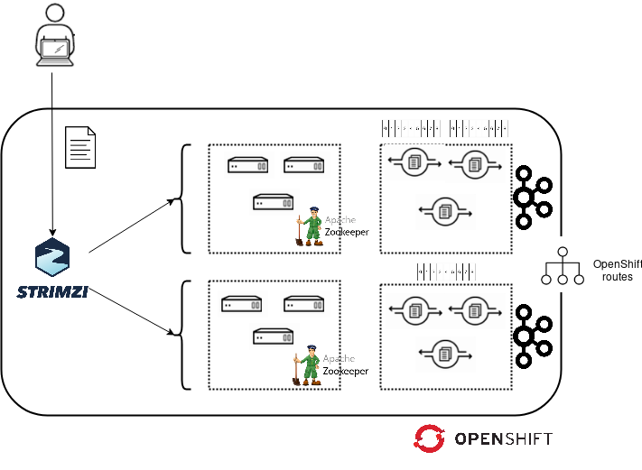

# Lab01: Deploy AMQ Streams

In this lab we will use **AMQ Streams** operator to deploy and configure kafka.

## High level architecture



## Lab's purpose

Illustrate how deploy **AMQ Streams** to be used by applications later.

## Deploying Kafka Cluster operator

Log in to bastion host. Then, create the `amq-streams` project:

```
$ oc new-project amq-streams
```

If you have not clone the repository clone it:

```
$ git clone https://github.com/jadebustos/ocp-science.git
$ cd ocp-science
```

Deploy operator and cluster operator and its related resources with:

```
$ cd hands-on-lab-script/amq-streams/
$ oc apply -f resources/cluster-operator/ -n amq-streams
```

This amq-streams Cluster Operator is configured to watch all namespaces since the **STRIMZI_NAMESPACE** environment variable from the operator yaml deployment file has the value *

As we have configured the Cluster Operator to watch all namespaces, it's also required to configure additional __ClusterRoleBindings__ to grant cluster-wide access to the Cluster Operator.

```
$ oc adm policy add-cluster-role-to-user strimzi-cluster-operator-namespaced --serviceaccount strimzi-cluster-operator -n amq-streams
$ oc adm policy add-cluster-role-to-user strimzi-entity-operator --serviceaccount strimzi-cluster-operator -n amq-streams
$ oc adm policy add-cluster-role-to-user strimzi-topic-operator --serviceaccount strimzi-cluster-operator -n amq-streams
```

## Create a new kafka cluster

>  **WARNING**: The goal of this lab is not focused on creating a valid production architecture, so we'll use ephemeral backed volumes (emptyDir) for our kafka cluster.
Ephemeral storage is commonly used for testing purposes.

To deploy a new kafka cluster, just create a new Kafka resource. The provided Kafka resource will deploy 3 kafka brokers + 3 zookeeper nodes. The entity operator is also automatically deployed by the cluster operator, is responsible for managing different entities in a running Kafka cluster such as users and topics.

```
$ oc new-project rhte2019
$ oc apply -f resources/openshift/kafka-cluster.yml -n rhte2019
```

>  **TIP**: Be certain you execute the above command in the directory **hands-on-lab-script/amq-streams** in the repository clone directory.

A successful deployment should look like:

```
$ oc get pod -n rhte2019
NAME                                          READY     STATUS    RESTARTS   AGE
rhte-cluster-entity-operator-57f77467-8h8c9   3/3       Running   0          47s
rhte-cluster-kafka-0                          2/2       Running   0          80s
rhte-cluster-kafka-1                          2/2       Running   0          80s
rhte-cluster-kafka-2                          2/2       Running   0          80s
rhte-cluster-zookeeper-0                      2/2       Running   0          111s
rhte-cluster-zookeeper-1                      2/2       Running   0          111s
rhte-cluster-zookeeper-2                      2/2       Running   0          111s
```

## Create new topic

Create a topic with a replication factor of 1 and 1 partition:

```
$ oc apply -f resources/openshift/rhte-topic.yml -n rhte2019
```

>  **TIP**: Be certain you execute the above command in the directory **hands-on-lab-script/amq-streams** in the repository clone directory.

Verify its creation with:

```
$ oc get kafkatopics -n rhte2019
NAME      PARTITIONS   REPLICATION FACTOR
rhte      1            1
```
```
$ oc rsh -n rhte2019 -c kafka rhte-cluster-kafka-0 bin/kafka-topics.sh --describe --bootstrap-server localhost:9092 --topic rhte
OpenJDK 64-Bit Server VM warning: If the number of processors is expected to increase from one, then you should configure the number of parallel GC threads appropriately using -XX:ParallelGCThreads=N
Topic:rhte	PartitionCount:1	ReplicationFactor:1	Configs:message.format.version=2.2-IV1

```

The traces above indicate that a new `rhte` topic is created with a replication factor of 1 and composed by 1 partition.
As stated previously, this environment is being created for learning purposes thus the previous topic was created as simple as possible: 1 replica + 1 partition

The provided kafka-cluster resource includes an option to make the operator create a route that will be be used for access kafka brokers from outside OCP cluster:

```
$ oc get route -n rhte2019
NAME                           HOST/PORT                                                      PATH      SERVICES                                PORT      TERMINATION   WILDCARD
rhte-cluster-kafka-0           rhte-cluster-kafka-0-rhte2019.apps.cluster.testing.com                   rhte-cluster-kafka-0                    9094      passthrough   None
rhte-cluster-kafka-1           rhte-cluster-kafka-1-rhte2019.apps.cluster.testing.com                   rhte-cluster-kafka-1                    9094      passthrough   None
rhte-cluster-kafka-2           rhte-cluster-kafka-2-rhte2019.apps.cluster.testing.com                   rhte-cluster-kafka-2                    9094      passthrough   None
rhte-cluster-kafka-bootstrap   rhte-cluster-kafka-bootstrap-rhte2019.apps.cluster.testing.com           rhte-cluster-kafka-external-bootstrap   9094      passthrough   None
```

Broker's routes must be used in the steps below

>  **TIP**: You should take note about the route, and the topic name because you will use them in the [Lab04: Machine Learning/Artificial Inteligence workloads](https://github.com/jadebustos/ocp-science/blob/master/hands-on-lab-script/applications/ml.md).

## Send a picture to the topic

Send a picture to the previous created topic using the provided containerized client.
In the example below, we used the containerized client to send to kafka a cat and a dog pictures.

```
$ sudo -i podman run -v ~/ocp-science/hands-on-lab-script/amq-streams/resources/pictures:/srv:z -it quay.io/rhte_2019/ocp-science-clients bash

$ kafkaClient -tls -brokers=rhte-cluster-kafka-0-rhte2019.apps.cluster-$GUID.$GUID.$SANDBOX.opentlc.com:443 \
-topic=rhte -insecure-skip-verify -file /srv/cat.jpg

** Replace $GUID with the value of your assigned GUID, and $SANDBOX with your subdomain.

$ kafkaClient -tls -brokers=rhte-cluster-kafka-0-rhte2019.apps.cluster-$GUID.$GUID.$SANDBOX.opentlc.com:443 \
 -topic=rhte -insecure-skip-verify -file /srv/dog.jpg
```

>  **TIP**: Be certain you execute the above command in the directory **hands-on-lab-script/amq-streams** in the repository clone directory.

### Lab resources

You can find all the resources used to build the client container [here](https://github.com/jadebustos/ocp-science/tree/master/hands-on-lab-script/intro/aio-client).

### Next Lab
Go to [Lab02: Ceph-nano deployment](https://github.com/jadebustos/ocp-science/blob/master/hands-on-lab-script/ceph/README.md)
