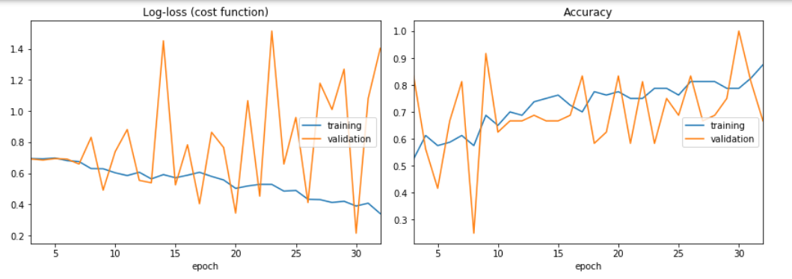

# Lab02: Machine Learning/Artificial Inteligence workloads

Machine learning and Artificial intelligence are one of technology topics we are used to hear about nowadays.

Although you can use several technologies to build these kind of workloads Jupyter notebooks are one of most common.

As an example you are going to deploy a Jupyter notebook that classifies images between two groups:

* Cats
* Dogs

This notebook is a modified version of the [image_classifier notebook](https://github.com/gsurma/image_classifier). 

> CURIOSITY: This notebook is a [Convolutional Neural Network Image classifier](https://en.wikipedia.org/wiki/Convolutional_neural_network).

When the application is running your tasks will be:

* You will have to train the model with a preloaded set of photos included in the notebook for the sake of simplicity.

> WARNING: Training the model with an appropiate set of images (25000) took 35 hours in an **Intel(R) Core(TM) i7-4710HQ CPU @ 2.50GHz** CPU. Due this lab is limited to 2 hours the notebook includes a very reduced set of images and the resulting model will be not accurate enough.

You should get a similar graph after you train the model (80 training images, 20 validation images):

For a well trained model (20000 training images, 5000 validation images):

* After training the model you will have to configure the notebook with the data of the [kafka broker you configured](../amq-streams/README.md).

* You will send an image to kafka.

* The notebook will read the image from kafka and will guess if the image is a cat or a dog.

## High level pod description

## Lab's pupouse

Illustrate how **OCP** + **AMQ Streams** can work together with **Machine learning/Artificial Intelligence** workloads to get the most of them.

## Application deployment

## Improvements

If the set of images used to train the model are not enough to get a good model then more images will have to be added.

As the container image used for this lab has the images included in it we have the following options:

1. Copy more images to the running container.
2. Create a new container with more images and redeploy the pod.

The first option has the inconvenient that the container is not using persistent storage the new images will be lost after the container ends. The second option could be time consuming, create a new container image, upload to the registry and redeploy the pod.

We have two alternatives using **Red Hat** products to solve it:

1. Using a kafka topic to store the images. (**AMQ Streams**)
2. Store the images in Object Storage. (**Red Hat Ceph Storage**)

Do you dare?

> TIP: Training images for animal type (cat or dog) have to be stored in **data/training/animal** and validation images in **data/validation/animal**.

## A bit of fun

If you are curious about this kind of applications or you only want just a bit of fun you can play a bit.

### Verifying how the well trained model is more accurate than the model you have just trained

* https://img.europapress.es/fotoweb/fotonoticia_20170622121827-17062170019_800.jpg
* https://images-na.ssl-images-amazon.com/images/I/917iZaaFOgL._SX425_.jpg
* https://img.europapress.es/fotoweb/fotonoticia_20170622121827-17062170039_125.jpg
* https://static.boredpanda.com/blog/wp-content/uploads/2019/04/adorable-hairless-sphynx-kittens-fb5-png__700.jpg
* https://img.europapress.es/fotoweb/fotonoticia_20170622121827-17062170139_125.jpg
* https://getleashedmag.com/wp-content/uploads/2017/01/spynh-feature.jpg
* https://img.europapress.es/fotoweb/fotonoticia_20170622121827-17062170079_125.jpg
* https://i.ytimg.com/vi/zUWlAtat8ww/hqdefault.jpg
* http://www.arrecal.com/images/1clasificado-collera-de-podencos-los-brincas.JPG
* https://merchdope-zpq4xnxcq9v.netdna-ssl.com/wp-content/uploads/2018/10/Afghan-Hound-1.jpg

### The well trained model is not performing as well as your model

* https://www.elheraldo.co/sites/default/files/styles/width_860/public/articulo/2018/05/12/perro.jpg?itok=o-V5_DxL
* https://pictures-of-cats.org/wp-content/uploads/2018/03/Sphynx-cat-by-Helmi-Flick-X.jpg
* https://media.metrolatam.com/2019/01/29/memeperrodrogado-42777b43147e26a68fab3fd0729b24a3-600x400.jpg
* https://pics.me.me/hairless-cats-hairless-cats-twitter-49621967.png

### The well trained model is performing quite poorly

* https://upload.wikimedia.org/wikipedia/commons/thumb/f/fe/American_Eskimo_Dog_1.jpg/245px-American_Eskimo_Dog_1.jpg el poorly bien, el well dice que es un gato
* https://img.europapress.es/fotoweb/fotonoticia_20170622121827_260.jpg
* https://www.dogalize.com/wp-content/uploads/2017/05/551-pdengo-portugues-cerdoso-grande.jpg

### Both models are trolling me?

* https://d17fnq9dkz9hgj.cloudfront.net/uploads/2018/04/Minskin_01.jpg
* https://img.europapress.es/fotoweb/fotonoticia_20170622121827-17062170159_125.jpg
* http://www.lifewithcatman.com/wp-content/uploads/2018/03/37023296_208811373306721_2331537861515411456_n.jpg
* https://img.europapress.es/fotoweb/fotonoticia_20170622121827-17062170069_125.jpg
* https://cdn.fstoppers.com/styles/large-16-9/s3/lead/2018/12/cat-parody-instagram-removal.jpg
* https://img.europapress.es/fotoweb/fotonoticia_20170622121827-17062170109_125.jpg
* http://www.sosgalgos.com/wp-content/uploads/2018/04/Puskas01_620x400.jpg

### Use your imagination

* Have you known any cartoon based on cat or dogs?
* You could try with your photo or a photo's friend/collegue ...
