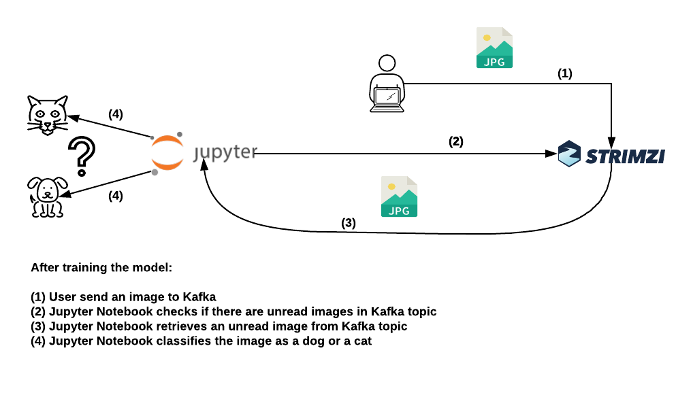
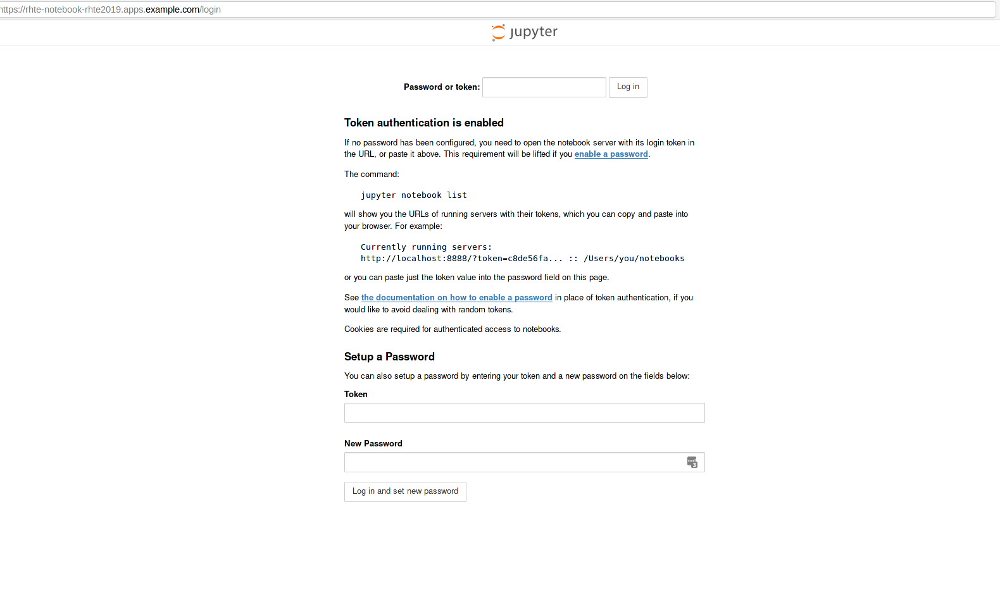

# Lab02: Machine Learning/Artificial Inteligence workloads

Machine learning and Artificial intelligence are one of technology topics we are used to hear about nowadays.

Although you can use several technologies to build these kind of workloads Jupyter notebooks are one of most common.

As an example you are going to deploy a Jupyter notebook that classifies images between two groups:

* Cats
* Dogs

This notebook is a modified version of the [image_classifier notebook](https://github.com/gsurma/image_classifier). 

> CURIOSITY: This notebook is a [Convolutional Neural Network Image classifier](https://en.wikipedia.org/wiki/Convolutional_neural_network).

When the application is running your tasks will be:

* You will have to train the model with a preloaded set of photos included in the notebook for the sake of simplicity.

> WARNING: Training the model with an appropiate set of images (25000) took 35 hours in an **Intel(R) Core(TM) i7-4710HQ CPU @ 2.50GHz** CPU. Due this lab is limited to 2 hours the notebook includes a very reduced set of images and the resulting model will be not accurate enough.

You should get a similar graph after you train the model (80 training images, 20 validation images):


For a well trained model (20000 training images, 5000 validation images):


* After training the model you will have to configure the notebook with the data of the [kafka broker you configured](../amq-streams/README.md).

* You will send an image to kafka.

* The notebook will read the image from kafka and will guess if the image is a cat or a dog.

## High level pod description



## Lab's purpose

Illustrate how **OCP** + **AMQ Streams** can work together with **Machine learning/Artificial Intelligence** workloads to get the most of them.

## Notebook deployment

Create notebook:
```
$ oc run --image=quay.io/rhte_2019/ai-notebook:latest --port=8080 rhte-notebook
```

Create service and route
```
$ oc expose dc rhte-notebook
$ oc create route edge --service=rhte-notebook
```

The notebook should be available at the exposed route:

```
$ oc get route
NAME            HOST/PORT                                 PATH      SERVICES        PORT      TERMINATION   WILDCARD
rhte-notebook   rhte-notebook-rhte2019.apps.example.com             rhte-notebook   <all>     edge          None
```

Using a browser go to the previous route https://rhte-notebook-rhte2019.apps.example.com



## AMQ Streams deployment
All resources used in this section are available under the directory `hands-on-lab-script/amq-streams/` of this repository

### Deploying Kafka Cluster operator

Create `amq-streams` project:

```
$ oc new-project amq-streams
```

This amq-streams cluster operator is Configured to watch to watch all namespaces since the **STRIMZI_NAMESPACE** environment variable from the operator yaml deployment file has the value *
As we have configured the Cluster Operator to watch all namespaces, it's also required to configure additional ClusterRoleBindings to grant cluster-wide access to the Cluste Operator.

```
$ oc adm policy add-cluster-role-to-user strimzi-cluster-operator-namespaced --serviceaccount strimzi-cluster-operator -n amq-streams
$ oc adm policy add-cluster-role-to-user strimzi-entity-operator --serviceaccount strimzi-cluster-operator -n amq-streams
$ oc adm policy add-cluster-role-to-user strimzi-topic-operator --serviceaccount strimzi-cluster-operator -n amq-streams
```

Deploy operator and cluster operator and its related resources with:

```
$ oc apply -f resources/cluster-operator/ -n amq-streams
```

### Create a new kafka cluster

> **Disclaimer:** The goal of this lab is not focused on creating a valid production architecture, so we'll use ephemeral backed volumes (emptyDir) for our kafka cluster.
Ephemeral storage is commonly used for testing purposes

To deploy a new kafka cluster, just create a new Kafka resource. The provided Kafka resource will deploy 3 kafka brokers + 3 zookeeper nodes. The entity operator is also automatically deployed by the cluster operator, is responsible for managing different entities in a running Kafka cluster such as users and topics.

```
$ oc new-project rhte2019
$ oc apply -f resources/kafka-cluster.yml -n rhte2019
```

A successful deployment should look like:

```
$ oc get pod -n rhte2019
NAME                                          READY     STATUS    RESTARTS   AGE
rhte-cluster-entity-operator-57f77467-8h8c9   3/3       Running   0          47s
rhte-cluster-kafka-0                          2/2       Running   0          80s
rhte-cluster-kafka-1                          2/2       Running   0          80s
rhte-cluster-kafka-2                          2/2       Running   0          80s
rhte-cluster-zookeeper-0                      2/2       Running   0          111s
rhte-cluster-zookeeper-1                      2/2       Running   0          111s
rhte-cluster-zookeeper-2                      2/2       Running   0          111s
```

### Create new topic

Create a topic with a replication factor of 1 and 1 partition:

```
$ oc apply -f resources/rhte-topic.yml -n rhte2019
```

Verify its creation with:

```
$ oc get kafkatopics -n rhte2019
NAME      PARTITIONS   REPLICATION FACTOR
rhte      5            1

$ oc rsh -n rhte2019 -c kafka rhte-cluster-kafka-0 bin/kafka-topics.sh --describe --bootstrap-server localhost:9092 --topic rhte
OpenJDK 64-Bit Server VM warning: If the number of processors is expected to increase from one, then you should configure the number of parallel GC threads appropriately using -XX:ParallelGCThreads=N
Topic:rhte      PartitionCount:3        ReplicationFactor:1     Configs:message.format.version=2.2-IV1
        Topic: rhte     Partition: 0    Leader: 2       Replicas: 2     Isr: 2
        Topic: rhte     Partition: 1    Leader: 0       Replicas: 0     Isr: 0
        Topic: rhte     Partition: 2    Leader: 1       Replicas: 1     Isr: 1
```

The traces above indicate that a new `rhte` topic is created with a Replication factor of 1 and composed by 1 partition.
As stated previously, this environment is being created for learning purposes thus the previous topic was created as simple as possible: 1 replica + 1 partition

The provided kafka-cluster resource includes an option to make the operator create a route that will be be used for access kafka brokers from outside OCP cluster:

```
$ oc get route -n rhte2019
NAME                           HOST/PORT                                                      PATH      SERVICES                                PORT      TERMINATION   WILDCARD
rhte-cluster-kafka-0           rhte-cluster-kafka-0-rhte2019.apps.cluster.testing.com                   rhte-cluster-kafka-0                    9094      passthrough   None
rhte-cluster-kafka-1           rhte-cluster-kafka-1-rhte2019.apps.cluster.testing.com                   rhte-cluster-kafka-1                    9094      passthrough   None
rhte-cluster-kafka-2           rhte-cluster-kafka-2-rhte2019.apps.cluster.testing.com                   rhte-cluster-kafka-2                    9094      passthrough   None
rhte-cluster-kafka-bootstrap   rhte-cluster-kafka-bootstrap-rhte2019.apps.cluster.testing.com           rhte-cluster-kafka-external-bootstrap   9094      passthrough   None
```

Broker's routes must be used in the steps below

### Send a picture to the previous topic

We can send a picture to the previous created topic using several methods. Some of them are included:

- [python2 client](../../hands-on-lab-script/amq-streams/clients/kafka_producer.py) (kafka module is required):

```
$ sudo dnf install python2-kafka
$ python2 kafka_producer.py  --brokers <kafka_broker_list> --file dog.jpg --use-tls --topic rhte
```

- [Golang client](../../hands-on-lab-script/amq-streams/clients/kafkaClient.go):

```
$ sudo go get github.com/Shopify/sarama
$ go build kafkaClient.go
$ ./kafkaClient -tls=true -brokers=<kafka_broker_list> -topic=rhte -file cat.jpg
```

## Improvements

If the set of images used to train the model are not enough to get a good model then more images will have to be added.

As the container image used for this lab has the images included in it we have the following options:

1. Copy more images to the running container.
2. Create a new container with more images and redeploy the pod.

The first option has the inconvenient that the container is not using persistent storage the new images will be lost after the container ends. The second option could be time consuming, create a new container image, upload to the registry and redeploy the pod.

We have two alternatives using **Red Hat** products to solve it:

1. Using a kafka topic to store the images. (**AMQ Streams**)
2. Store the images in Object Storage. (**Red Hat Ceph Storage**)

Do you dare?

> TIP: Training images for animal type (cat or dog) have to be stored in **data/training/animal** and validation images in **data/validation/animal**.

## A bit of fun?

If you are curious about this kind of applications or you only want to have just a bit of fun you can play a bit. Here some suggestions.

### Verifying how the well trained model is more accurate than the model you have just trained

* https://img.europapress.es/fotoweb/fotonoticia_20170622121827-17062170019_800.jpg
* https://images-na.ssl-images-amazon.com/images/I/917iZaaFOgL._SX425_.jpg
* https://img.europapress.es/fotoweb/fotonoticia_20170622121827-17062170039_125.jpg
* https://static.boredpanda.com/blog/wp-content/uploads/2019/04/adorable-hairless-sphynx-kittens-fb5-png__700.jpg
* https://img.europapress.es/fotoweb/fotonoticia_20170622121827-17062170139_125.jpg
* https://getleashedmag.com/wp-content/uploads/2017/01/spynh-feature.jpg
* https://img.europapress.es/fotoweb/fotonoticia_20170622121827-17062170079_125.jpg
* https://i.ytimg.com/vi/zUWlAtat8ww/hqdefault.jpg
* http://www.arrecal.com/images/1clasificado-collera-de-podencos-los-brincas.JPG
* https://merchdope-zpq4xnxcq9v.netdna-ssl.com/wp-content/uploads/2018/10/Afghan-Hound-1.jpg

### The well trained model is not performing as well as your model

* https://www.elheraldo.co/sites/default/files/styles/width_860/public/articulo/2018/05/12/perro.jpg?itok=o-V5_DxL
* https://pictures-of-cats.org/wp-content/uploads/2018/03/Sphynx-cat-by-Helmi-Flick-X.jpg
* https://media.metrolatam.com/2019/01/29/memeperrodrogado-42777b43147e26a68fab3fd0729b24a3-600x400.jpg
* https://pics.me.me/hairless-cats-hairless-cats-twitter-49621967.png

### The well trained model is performing quite poorly

* https://upload.wikimedia.org/wikipedia/commons/thumb/f/fe/American_Eskimo_Dog_1.jpg/245px-American_Eskimo_Dog_1.jpg
* https://img.europapress.es/fotoweb/fotonoticia_20170622121827_260.jpg
* https://www.dogalize.com/wp-content/uploads/2017/05/551-pdengo-portugues-cerdoso-grande.jpg

### Both models are trolling me?

* https://d17fnq9dkz9hgj.cloudfront.net/uploads/2018/04/Minskin_01.jpg
* https://img.europapress.es/fotoweb/fotonoticia_20170622121827-17062170159_125.jpg
* http://www.lifewithcatman.com/wp-content/uploads/2018/03/37023296_208811373306721_2331537861515411456_n.jpg
* https://img.europapress.es/fotoweb/fotonoticia_20170622121827-17062170069_125.jpg
* https://cdn.fstoppers.com/styles/large-16-9/s3/lead/2018/12/cat-parody-instagram-removal.jpg
* https://img.europapress.es/fotoweb/fotonoticia_20170622121827-17062170109_125.jpg
* http://www.sosgalgos.com/wp-content/uploads/2018/04/Puskas01_620x400.jpg

### Use your imagination

* Have you known any cartoon based on a cat or a dog?
* You could try with your photo or a photo's friend/collegue ...
